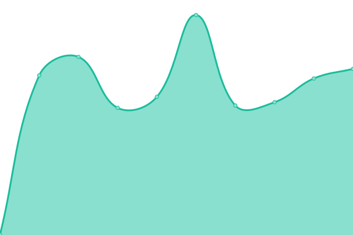
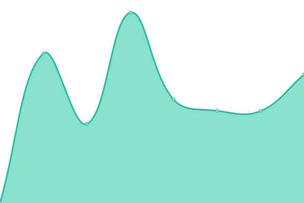

# [📈 Live Status](https://status.davidrychly.cz): <!--live status--> **🟩 All systems operational**

This repository contains the open-source uptime monitor and status page for [David Rychlý](https://davidrychly.cz/), powered by [Upptime](https://github.com/upptime/upptime).

With [Upptime](https://upptime.js.org), you can get your own unlimited and free uptime monitor and status page, powered entirely by a GitHub repository. We use [Issues](https://github.com/redoper1/upptime-status-page/issues) as incident reports, [Actions](https://github.com/redoper1/upptime-status-page/actions) as uptime monitors, and [Pages](https://status.davidrychly.cz) for the status page.

<!--start: status pages-->
<!-- This summary is generated by Upptime (https://github.com/upptime/upptime) -->
<!-- Do not edit this manually, your changes will be overwritten -->
<!-- prettier-ignore -->
| URL | Status | History | Response Time | Uptime |
| --- | ------ | ------- | ------------- | ------ |
|  [Personal website](https://www.davidrychly.cz/) | 🟩 Up | [personal-website.yml](https://github.com/redoper1/upptime-status-page/commits/HEAD/history/personal-website.yml) | 

 339ms
     
 | 

<a href="https://status.davidrychly.cz/history/personal-website">100.00%</a>
    

|  [Blog](https://blog.davidrychly.cz/) | 🟩 Up | [blog.yml](https://github.com/redoper1/upptime-status-page/commits/HEAD/history/blog.yml) | 

 1246ms
     
 | 

<a href="https://status.davidrychly.cz/history/blog">100.00%</a>
    

|  [Docs](https://docs.davidrychly.cz/) | 🟩 Up | [docs.yml](https://github.com/redoper1/upptime-status-page/commits/HEAD/history/docs.yml) | 

 228ms
     
 | 

<a href="https://status.davidrychly.cz/history/docs">100.00%</a>
    

|  [VPS](https://vps.davidrychly.cz/) | 🟩 Up | [vps.yml](https://github.com/redoper1/upptime-status-page/commits/HEAD/history/vps.yml) | 

 557ms
     
 | 

<a href="https://status.davidrychly.cz/history/vps">100.00%</a>
    

|  [Htmlmage API](https://htmlmage.davidrychly.cz/) | 🟩 Up | [htmlmage-api.yml](https://github.com/redoper1/upptime-status-page/commits/HEAD/history/htmlmage-api.yml) | 

 590ms
     
 | 

<a href="https://status.davidrychly.cz/history/htmlmage-api">100.00%</a>
    

|  [Imagemin API](https://imagemin.davidrychly.cz/) | 🟩 Up | [imagemin-api.yml](https://github.com/redoper1/upptime-status-page/commits/HEAD/history/imagemin-api.yml) | 

 552ms
     
 | 

<a href="https://status.davidrychly.cz/history/imagemin-api">100.00%</a>
    

|  [Speedtest](https://speedtest.davidrychly.cz/) | 🟩 Up | [speedtest.yml](https://github.com/redoper1/upptime-status-page/commits/HEAD/history/speedtest.yml) | 

 582ms
     
 | 

<a href="https://status.davidrychly.cz/history/speedtest">100.00%</a>
    

|  [Jitsi](https://jitsi.davidrychly.cz/) | 🟩 Up | [jitsi.yml](https://github.com/redoper1/upptime-status-page/commits/HEAD/history/jitsi.yml) | 

 591ms
     
 | 

<a href="https://status.davidrychly.cz/history/jitsi">100.00%</a>
    

|  [Activities tracking app](https://activities-tracking-app.davidrychly.cz/login) | 🟩 Up | [activities-tracking-app.yml](https://github.com/redoper1/upptime-status-page/commits/HEAD/history/activities-tracking-app.yml) | 

 601ms
     
 | 

<a href="https://status.davidrychly.cz/history/activities-tracking-app">100.00%</a>
    

|  [Version check API](https://version-check.davidrychly.cz/) | 🟩 Up | [version-check-api.yml](https://github.com/redoper1/upptime-status-page/commits/HEAD/history/version-check-api.yml) | 

 608ms
     
 | 

<a href="https://status.davidrychly.cz/history/version-check-api">100.00%</a>
    

|  [Status](https://status.davidrychly.cz/) | 🟩 Up | [status.yml](https://github.com/redoper1/upptime-status-page/commits/HEAD/history/status.yml) | 

 155ms
     
 | 

<a href="https://status.davidrychly.cz/history/status">100.00%</a>
    

|  [Analytics](https://analytics.davidrychly.cz/) | 🟩 Up | [analytics.yml](https://github.com/redoper1/upptime-status-page/commits/HEAD/history/analytics.yml) | 

 1293ms
     
 | 

<a href="https://status.davidrychly.cz/history/analytics">100.00%</a>
    

<!--end: status pages-->

[**Visit our status website →**](https://status.davidrychly.cz)

## 📄 License

- Powered by: [Upptime](https://github.com/upptime/upptime)
- Code: [MIT](./LICENSE) © [David Rychlý](https://davidrychly.cz/)
- Data in the `./history` directory: [Open Database License](https://opendatacommons.org/licenses/odbl/1-0/)
